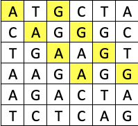

# Api Mutantes

Magneto quiere reclutar la mayor cantidad de mutantes para poder luchar
contra los X-Men.
Te ha contratado a ti para que desarrolles un proyecto que detecte si un
humano es mutante basándose en su secuencia de ADN.

En donde recibirás como parámetro un array de Strings que representan cada fila de una tabla
de (NxN) con la secuencia del ADN. Las letras de los Strings solo pueden ser: (A,T,C,G), las
cuales representa cada base nitrogenada del ADN.

Sabrás si un humano es mutante, si encuentras más de una secuencia de cuatro letras
iguales , de forma oblicua, horizontal o vertical.

# Apis de prueba


### POST Mutant

**Endpoint** 
```http
http://adnmutant-env.eba-rpdwbmzt.us-east-1.elasticbeanstalk.com/api/mutant
```
**Body** 
```json
“dna”:["ATGCGA","CAGTGC","TTATGT","AGAAGG","CCCCTA","TCACTG"]
```
**Response** para DNA Mutante
```json
200 OK
```
**Response** para DNA Humano
```json
403 Forbidden
```

### GET Stats

**Endpoint** 
```http
http://adnmutant-env.eba-rpdwbmzt.us-east-1.elasticbeanstalk.com/api/stats
```
**Response**
```json
200 OK
{
    "count_mutant_dna": 0,
    "count_human_dna": 0,
    "ratio": 0.0
}
```

### Implementacion y tecnologias usadas
- [Java11](http://sparkjava.com)
- [SpringBoot](https://spring.io/projects/spring-boot)
- [DynamoDb](https://aws.amazon.com/es/dynamodb)
- [Gson](https://github.com/google/gson)
- [Log4j](https://logging.apache.org/log4j/2.x/)
- [jUnit](http://junit.org/junit5/)
- [Lombok](https://projectlombok.org/)
- [AWS Eastic BeanStalk](https://console.aws.amazon.com/elasticbeanstalk/home)
- [Jacoco](https://www.jacoco.org/jacoco/trunk/index.html)


### Flujos de busqueda en el array

**Busqueda DiagLeftRigth**


**Busqueda DiagRigthLeft**



**Busqueda LeftRigth**


**Busqueda TopDown**


## Cobertura Pruebas Unitarias


-[Report](modular-test/index.html)


# Arquitectura del Proyecto


## Domain

Es el módulo más interno de la arquitectura, pertenece a la capa del dominio y encapsula la lógica y reglas del negocio mediante modelos y entidades del dominio.

## Usecases

Este módulo gradle perteneciente a la capa del dominio, implementa los casos de uso del sistema, define lógica de aplicación y reacciona a las invocaciones desde el módulo de entry points, orquestando los flujos hacia el módulo de entities.

## Infrastructure

### Driven Adapters

Los driven adapter representan implementaciones externas a nuestro sistema, como lo son conexiones a servicios rest,
soap, bases de datos, lectura de archivos planos, y en concreto cualquier origen y fuente de datos con la que debamos
interactuar.

### Entry Points

Los entry points representan los puntos de entrada de la aplicación o el inicio de los flujos de negocio.
